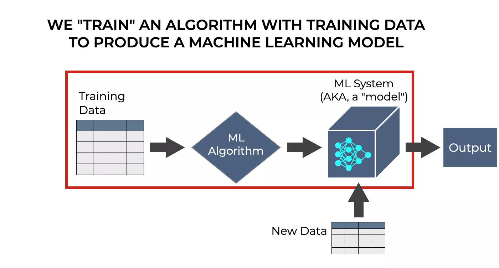

# H1N1 and Seasonal Flu vaccination model
(This was part of my COMP4030: Data Science in Machine Learning module's coursework)

## INTRODUCTION
In 2009, the US among many other countries faced a life-threatening pandemic with the emergence of the H1N1 flu. It was estimated by CDC that over 500,000 people died from the H1N1 flu and globally, 80% of the deaths were estimated to have occurred in people younger than 65 years of age. In August 2010, WHO declared an end to the global 2009 H1N1 influenza pandemic. However, the H1N1 virus continues to circulate as a seasonal flu virus and causes illness, hospitalization, and deaths worldwide every year. In our paper, we have predicted how likely people are to get H1N1 and seasonal flu vaccination from the survey data that comes from the National 2009 H1N1 Flu Survey (NHFS). Our results were consistent with previous studies that people with good hygienic behavior and a higher level of education were more likely to get vaccinated.

## DATA
The main aim of this project was to predict how likely an individual is to receive the H1N1 and the seasonal vaccination based on the information provided for that individual. The data comes from the National 2009 H1N1 Flu Survey (NHFS) which consists of 3 CSV files and the data of over 53,000 people divided across training and test set. Each record has 35 different features for everyone. The training label file contains the probability for an individual to receive the H1N1 and seasonal vaccination for the training dataset. We have used XGBoost and Logistic Regression as our Machine Learning approach to predict the required probability.

https://cdn-coiao.nitrocdn.com/CYHudqJZsSxQpAPzLkHFOkuzFKDpEHGF/assets/static/optimized/rev-85bf93c/wp-content/uploads/2022/04/machine-learning-training_simple-visual-example.png

A. Data Imputation
  Features with the missing values were mostly categorical, hence, mode imputation was used.
B. Data Encoding
  Two different approaches was used. Where a mixture of Label encoding and One hot encoding was used.
C. Feature Selection
  Correlation based and chi square feature selection method were used.
D. Data Scaling
  Data was then normalised.
E. Data Spliting
  A 80-20 split was used.
F. Model Training and Hyper-parameter tuning
  Logistic regression and XGBoost methods were used to train the model. Further, to find the best hyperparameters, GridseacrchCV was used.
E. Results
•	In first approach we have looked into the correlations between features, and we have observed that there are good correaltions between behavioral features similar to opinion features. Not only that, but we also observed that hhs geo region features are less correlated and can be removed from the model during feature extraction. In the second approach, we have observed that the number of females is higher than the number of males in our data and it is observed that the females are the ones who are more likely to take the h1n1 and seasonal flu vaccine. The number of married people is higher than the number of un-married people in our data and it is observed that the married people are the ones who are more likely to take the h1n1 and seasonal flu vaccine. The number of people who own their places are higher than the number of people who live in a rented place and it is observed that the people who own their place are the ones who are more likely to take the h1n1 and seasonal flu vaccine.
•	We can see that in both approaches some combination of OneHot and Label encoding has been used. We can also see that scaling has also been performed in both the approaches which is where the similarities end for both the approaches where in the first approach correlationbased feature extraction has been performed while in the second approach chi-squared feature selection has been used to select the key features. For first approach only 27 features have been used while in the second approach 37 features have been used to obtain the best scores.
•	In Data classification for first approach, we have used XGBoost machine learning algorithm and for the second approach we have used Logistic regression machine learning algorithm. Looking at Table 1 we can see that Logistic regression for H1N1 vaccine has got the highest score of 83% for training data set compared to 82% and 78% of Logistic regression for Seasonal vaccine and XGBoost respectively. When it comes to predicting on test data set, we can see that similar to training data set Logistic regression for H1N1 vaccine has got the exact same 83% while Logistic regression for Seasonal vaccine has got 78% which is lower than 82% that it got in training data set. Lastly, we can see that XGBoost got 66% in the test dataset which is low enough than 78% to hint that there might be a very slight over fitting of the model. Saying that, we can see that Logistic regression for H1N1 vaccine has got the highest ROC AUC score of 85% followed by 82% obtained by XGBoost and the Logistic regression for seasonal vaccine with 61%.

TLDR;
The Logistic Regression performed better for predicting the H1N1 flu and seasonal flu vaccination probability with an accuracy of 83% and 78%.

## CONCLUSION
In this study, I predicted the probability of an individual who is likely to get vaccinated based on various features and factors provided by the NHFS data. The best accuracy was yielded by the logistic regression technique, which yielded an accuracy of 83% for the H1N1 flu and 85% for the Seasonal flu. For both labels, logistic regression yielded a better ROC score for the testing data set. The XG Boost method yielded a low score because there must be overfitting on the training data.
A few conclusions were made which also answered our research questions: -
• There exists a correlation between the behavior of an individual and the probability of them getting H1N1 and seasonal flu vaccines. Individuals with better hygienic behaviors are more likely to get vaccinated.
• Out of those who took the vaccines, most of them were college students. This concluded that there might be a small correlation between the level of education of an individual and the likelihood of them getting vaccinated.
• I also concluded from the test data that knowing the disease played an important role in the decision- making of an individual. Individuals having even a little knowledge of the H1N1 virus opted to get vaccinated in comparison to the individuals with no knowledge of the subject.

